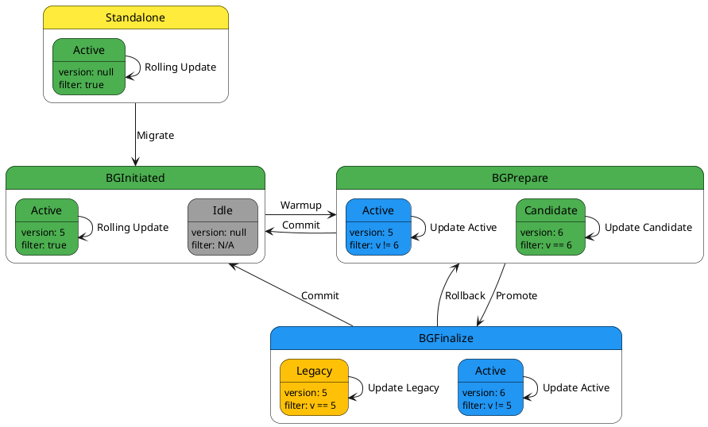

<!-- TOC -->
* [What is it](#what-is-it)
  * [TrackingVersionFilterImpl](#trackingversionfilterimpl)
  * [Migration to Blue Green 2](#migration-to-blue-green-2)
<!-- TOC -->

# What is it
This module provides java predicate implementation to test acceptable values of `X-Version` header for running      implementation that tracks state of Blue/Green in a runtime 
Implementing Blue/Green approach we need a tool to filter messages by value in `X-Version` header received from
Kafka topic.

deployment-version-tracker module provides single interface:
```
public interface TrackingVersionFilter extends Predicate<String> {
}
```
with two implementations: 
* `TrackingVersionFilterImpl` - implementation intended to be used in production code
* `InMemoryTrackingVersionFilter` - implementation for localdev and test purposes
* `LocalDevTrackingVersionFilter` - obsolete implementation. Migrate to `InMemoryTrackingVersionFilter`  


## TrackingVersionFilterImpl

Filter clause value changed during Blue/Green states according to diagram below: 



## Migration to Blue Green 2
TrackingVersionFilterImpl implementation for Blue Green 2 depends on org.qubership.cloud.bluegreen.api.service.BlueGreenStatePublisher from blue-green-state-monitor-java.  
Refer to blue-green-state-monitor-java's documentation regarding how to set up BlueGreenStatePublisher.

Usage:

```java
    public void newFilter(BlueGreenStatePublisher publisher) {
    var filter = new TrackingVersionFilterImpl(publisher);
    var result = filter.test("v1");
}
```