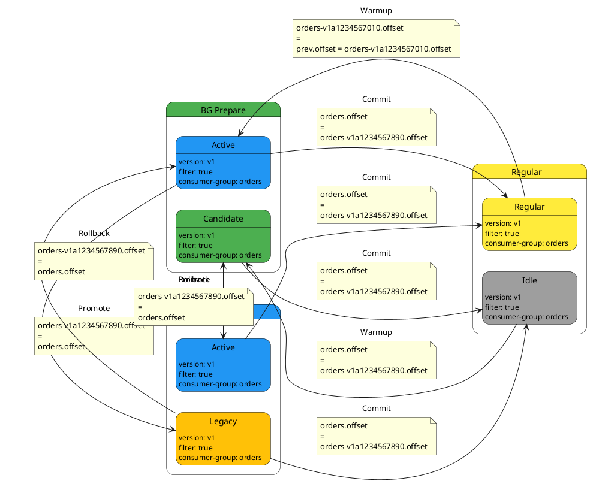

```plantuml
@startuml

left to right direction

skinparam state {
    FontColor Black
    BorderColor Black
    
    BackgroundColor<<Regular>> #FFEB3B
    
    BackgroundColor<<Idle>> #9E9E9E
    BackgroundColor<<Blue>> #2196F3
    BackgroundColor<<Green>> #4CAF50
    BackgroundColor<<Legacy>> #FFC107
}

state "Regular" as Regular <<Regular>> {
   state "Regular" as RegularRegular <<Regular>> {
   RegularRegular : version: v1
   RegularRegular : filter: true
   RegularRegular : consumer-group: orders
  }

  state "Idle" as RegularIdle <<Idle>> {
   RegularIdle : version: v1
   RegularIdle : filter: true
   RegularIdle : consumer-group: orders
  }
}

state "BG Prepare" as BGPrepare <<Green>> {
   state "Active" as BGPrepareActive <<Blue>> {
   BGPrepareActive : version: v1
   BGPrepareActive : filter: true
   BGPrepareActive : consumer-group: orders
  }

  state "Candidate" as BGPrepareCandidate <<Green>> {
   BGPrepareCandidate : version: v1
   BGPrepareCandidate : filter: true
   BGPrepareCandidate : consumer-group: orders
  }
}

state "BG Finalize" as BGFinalize <<Blue>> {
  state "Legacy" as BGFinalizeLegacy <<Legacy>> {
   BGFinalizeLegacy : version: v1
   BGFinalizeLegacy : filter: true
   BGFinalizeLegacy : consumer-group: orders
  }

   state "Active" as BGFinalizeActive <<Blue>> {
   BGFinalizeActive : version: v1
   BGFinalizeActive : filter: true
   BGFinalizeActive : consumer-group: orders
  }
}

RegularRegular -> BGPrepareActive : Warmup

note on link
orders-v1a1234567010.offset
=
prev.offset = orders-v1a1234567010.offset
end note

RegularIdle -> BGPrepareCandidate : Warmup

note on link
orders.offset
=
orders-v1a1234567890.offset
end note

BGPrepareActive --> RegularRegular : Commit

note on link
orders.offset
=
orders-v1a1234567890.offset
end note

BGPrepareCandidate --> RegularIdle : Commit

note on link
orders.offset
=
orders-v1a1234567890.offset
end note


BGFinalizeActive --> RegularRegular : Commit

note on link
orders.offset
=
orders-v1a1234567890.offset
end note

BGFinalizeLegacy --> RegularIdle : Commit

note on link
orders.offset
=
orders-v1a1234567890.offset
end note


BGPrepareActive --> BGFinalizeLegacy : Promote

note on link
orders-v1a1234567890.offset
=
orders.offset
end note


BGPrepareCandidate --> BGFinalizeActive : Promote

note on link
orders-v1a1234567890.offset
=
orders.offset
end note


BGFinalizeLegacy --> BGPrepareActive : Rollback

note on link
orders-v1a1234567890.offset
=
orders.offset
end note


BGFinalizeActive --> BGPrepareCandidate : Rollback

note on link
orders-v1a1234567890.offset
=
orders.offset
end note

@enduml
```