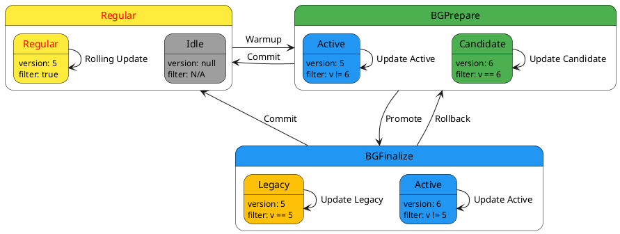

```plantuml
@startuml

skinparam state {
    FontColor Black
    BorderColor Black
    
    BackgroundColor<<Regular>> #FFEB3B
    FontColor<<Regular>> Red
    
    BackgroundColor<<Idle>> #9E9E9E
    BackgroundColor<<Blue>> #2196F3
    BackgroundColor<<Green>> #4CAF50
    BackgroundColor<<Legacy>> #FFC107
}

state "Regular" as Regular <<Regular>> {
  state "Regular" as RegularRegular <<Regular>> {
   RegularRegular :<color:black> version: 5
   RegularRegular :<color:black> filter: true
  }
  state "Idle" as RegularIdle <<Idle>> {
   RegularIdle : version: null
   RegularIdle : filter: N/A
  }
}

state "BGPrepare" as BGPrepare <<Green>> {
  state "Active" as BGPrepareActive <<Blue>> {
   BGPrepareActive : version: 5
   BGPrepareActive : filter: v != 6
  }
  state "Candidate" as BGPrepareCandidate <<Green>> {
   BGPrepareCandidate : version: 6
   BGPrepareCandidate : filter: v == 6
  }
}

state "BGFinalize" as BGFinalize  <<Blue>> {
  state "Legacy" as BGFinalizeLegacy <<Legacy>> {
   BGFinalizeLegacy : version: 5
   BGFinalizeLegacy : filter: v == 5
  }
  state "Active" as BGFinalizeActive <<Blue>> {
   BGFinalizeActive : version: 6
   BGFinalizeActive : filter: v != 5
  }
}

RegularRegular -> RegularRegular : Rolling Update
Regular -right-> BGPrepare : Warmup

BGPrepare -left-> Regular : Commit
BGFinalize -> Regular : Commit

BGPrepareActive -> BGPrepareActive : Update Active
BGPrepareCandidate -> BGPrepareCandidate : Update Candidate

BGPrepare -down-> BGFinalize : Promote
BGFinalize -> BGPrepare : Rollback

BGFinalizeLegacy -> BGFinalizeLegacy : Update Legacy
BGFinalizeActive -> BGFinalizeActive : Update Active

@enduml
```