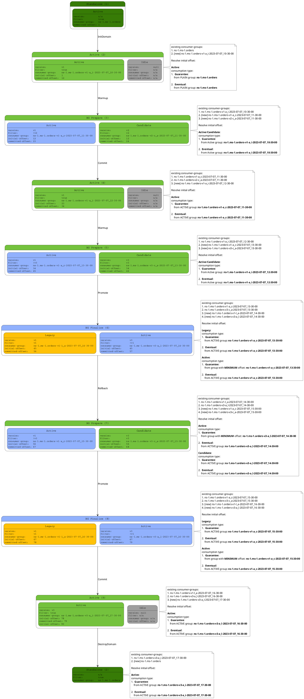

```plantuml
@startuml

'left to right direction

skinparam state {
    FontColor Black
    FontName Courier
    BorderColor Black
        
    BackgroundColor<<NonBGActive>> #377b06
    BackgroundColor<<Idle>> #9E9E9E
    BackgroundColor<<Blue>> #91b1fd
    BackgroundColor<<Green>> #74c23d
    BackgroundColor<<Legacy>> #FFC107
}

state "Standalone (1)" as Standalone1 <<NonBGActive>> {
   state "Active" as StandaloneActive1 <<NonBGActive>> {
   StandaloneActive1 : version:          n/a
   StandaloneActive1 : filter:           true
   StandaloneActive1 : consumer-group:   ns-1.ms-1.orders
   StandaloneActive1 : committed-offset: 1
  }
}

Standalone1 --> Active1 : InitDomain

note right #white
existing consumer-groups:
1. ns-1.ms-1.orders
2. [new] ns-1.ms-1.orders-v1-a_i-2023-07-07_10-30-00

Resolve initial offset:

**Active**:
consumption type:
1.  **Guarantee**: 
    from PLAIN group: **ns-1.ms-1.orders**
    
2.  **Eventual**: 
    from PLAIN group: **ns-1.ms-1.orders**
end note

state "Active (2)" as Active1 <<Green>> {
   state "Active" as ActiveActive1 <<Green>> {
   ActiveActive1 : version:           v1
   ActiveActive1 : filter:            true
   ActiveActive1 : consumer-group:    ns-1.ms-1.orders-v1-a_i-2023-07-07_10-30-00
   ActiveActive1 : initial-offset:    1
   ActiveActive1 : committed-offset:  12
  }

  state "Idle" as ActiveIdle1 <<Idle>> {
   ActiveIdle1 : version:          null
   ActiveIdle1 : filter:           n/a
   ActiveIdle1 : consumer-group:   n/a
   ActiveIdle1 : initial-offset:   n/a
   ActiveIdle1 : committed-offset: n/a
  }
}

Active1 --> BGPrepare1 : Warmup

note right #white
existing consumer-groups:
1. ns-1.ms-1.orders-v1-a_i-2023-07-07_10-30-00
2. [new] ns-1.ms-1.orders-v1-a_c-2023-07-07_11-30-00
3. [new] ns-1.ms-1.orders-v2-c_a-2023-07-07_11-30-00

Resolve initial offset:

**Active**/**Candidate**:
consumption type:
1.  **Guarantee**: 
    from Active group: **ns-1.ms-1.orders-v1-a_i-2023-07-07_10-30-00**
    
2.  **Eventual**: 
    from Active group: **ns-1.ms-1.orders-v1-a_i-2023-07-07_10-30-00**
end note

state "BG Prepare (3)" as BGPrepare1 <<Green>> {
   state "Active" as BGPrepareActive1 <<Blue>> {
   BGPrepareActive1 : version:          v1
   BGPrepareActive1 : filter:           !v2
   BGPrepareActive1 : consumer-group:   ns-1.ms-1.orders-v1-a_c-2023-07-07_11-30-00
   BGPrepareActive1 : initial-offset:   12
   BGPrepareActive1 : committed-offset: 23
 }

  state "Candidate" as BGPrepareCandidate1 <<Green>> {
   BGPrepareCandidate1 : version:           v2
   BGPrepareCandidate1 : filter:            v2
   BGPrepareCandidate1 : consumer-group:    ns-1.ms-1.orders-v2-c_a-2023-07-07_11-30-00
   BGPrepareCandidate1 : initial-offset:    12
   BGPrepareCandidate1 : committed-offset:  24
  }
}

BGPrepare1 --> Active2 : Commit

note right #white
existing consumer-groups:
1. ns-1.ms-1.orders-v1-a_c-2023-07-07_11-30-00
2. ns-1.ms-1.orders-v2-c_a-2023-07-07_11-30-00
3. [new] ns-1.ms-1.orders-v1-a_i-2023-07-07_12-30-00

Resolve initial offset:

**Active**:
consumption type:
1.  **Guarantee**: 
    from ACTIVE group: **ns-1.ms-1.orders-v1-a_c-2023-07-07_11-30-00**
    
2.  **Eventual**: 
    from ACTIVE group: **ns-1.ms-1.orders-v1-a_c-2023-07-07_11-30-00**
end note

state "Active (4)" as Active2 <<Green>> {
   state "Active" as ActiveActive2 <<Green>> {
   ActiveActive2 : version:           v1
   ActiveActive2 : filter:            true
   ActiveActive2 : consumer-group:    ns-1.ms-1.orders-v1-a_i-2023-07-07_12-30-00
   ActiveActive2 : initial-offset:    23
   ActiveActive2 : committed-offset:  34
  }

  state "Idle" as ActiveIdle2 <<Idle>> {
   ActiveIdle2 : version:          null
   ActiveIdle2 : filter:           n/a
   ActiveIdle2 : consumer-group:   n/a
   ActiveIdle2 : initial-offset:   n/a
   ActiveIdle2 : committed-offset: n/a
  }
}

Active2 --> BGPrepare2 : Warmup

note right #white
existing consumer-groups:
1. ns-1.ms-1.orders-v1-a_i-2023-07-07_12-30-00
2. [new] ns-1.ms-1.orders-v1-a_c-2023-07-07_13-30-00
3. [new] ns-1.ms-1.orders-v3-c_a-2023-07-07_13-30-00

Resolve initial offset:

**Active**/**Candidate**:
consumption type:
1.  **Guarantee**: 
    from Active group: **ns-1.ms-1.orders-v1-a_i-2023-07-07_12-30-00**
    
2.  **Eventual**: 
    from Active group: **ns-1.ms-1.orders-v1-a_i-2023-07-07_12-30-00**
end note

state "BG Prepare (5)" as BGPrepare2 <<Green>> {
   state "Active" as BGPrepareActive2 <<Blue>> {
   BGPrepareActive2 : version:          v1
   BGPrepareActive2 : filter:           !v3
   BGPrepareActive2 : consumer-group:   ns-1.ms-1.orders-v1-a_c-2023-07-07_13-30-00
   BGPrepareActive2 : initial-offset:   34
   BGPrepareActive2 : committed-offset: 45
  }

  state "Candidate" as BGPrepareCandidate2 <<Green>> {
   BGPrepareCandidate2 : version:           v3
   BGPrepareCandidate2 : filter:            v3
   BGPrepareCandidate2 : consumer-group:    ns-1.ms-1.orders-v3-c_a-2023-07-07_13-30-00
   BGPrepareCandidate2 : initial-offset:    34
   BGPrepareCandidate2 : committed-offset:  46
  }
}

BGPrepare2 --> BGFinalize2 : Promote

note right #white
existing consumer-groups:
1. ns-1.ms-1.orders-v1-a_c-2023-07-07_13-30-00
2. ns-1.ms-1.orders-v3-c_a-2023-07-07_13-30-00
3. [new] ns-1.ms-1.orders-v1-l_a-2023-07-07_14-30-00
4. [new] ns-1.ms-1.orders-v3-a_l-2023-07-07_14-30-00

Resolve initial offset:

**Legacy**:
consumption type:
1.  **Guarantee**: 
    from ACTIVE group: **ns-1.ms-1.orders-v1-a_c-2023-07-07_13-30-00**
    
2.  **Eventual**: 
    from ACTIVE group: **ns-1.ms-1.orders-v1-a_c-2023-07-07_13-30-00**

**Active**:
consumption type:
1.  **Guarantee**: 
    from group with **MINIMUM** offset: **ns-1.ms-1.orders-v1-a_c-2023-07-07_13-30-00**
    
2.  **Eventual**: 
    from ACTIVE group: **ns-1.ms-1.orders-v1-a_c-2023-07-07_13-30-00**
end note

state "BG Finalize (6)" as BGFinalize2 <<Blue>> {
  state "Legacy" as BGFinalizeLegacy2 <<Legacy>> {
   BGFinalizeLegacy2 : version:             v1
   BGFinalizeLegacy2 : filter:              v1
   BGFinalizeLegacy2 : consumer-group:      ns-1.ms-1.orders-v1-l_a-2023-07-07_14-30-00
   BGFinalizeLegacy2 : initial-offset:      45
   BGFinalizeLegacy2 : committed-offset:    56
  }

   state "Active" as BGFinalizeActive2 <<Blue>> {
   BGFinalizeActive2 : version:             v3
   BGFinalizeActive2 : filter:              !v1
   BGFinalizeActive2 : consumer-group:      ns-1.ms-1.orders-v3-a_l-2023-07-07_14-30-00
   BGFinalizeActive2 : initial-offset:      45
   BGFinalizeActive2 : committed-offset:    57
  }
}

BGFinalize2 --> BGPrepare3 : Rollback

note right #white
existing consumer-groups:
1. ns-1.ms-1.orders-v1-l_a-2023-07-07_14-30-00
2. ns-1.ms-1.orders-v3-a_l-2023-07-07_14-30-00
3. [new] ns-1.ms-1.orders-v1-a_c-2023-07-07_15-30-00
4. [new] ns-1.ms-1.orders-v3-c_a-2023-07-07_15-30-00

Resolve initial offset:

**Active**:
consumption type:
1.  **Guarantee**: 
    from group with **MINIMUM** offset: **ns-1.ms-1.orders-v3-a_l-2023-07-07_14-30-00**
    
2.  **Eventual**: 
    from ACTIVE group: **ns-1.ms-1.orders-v3-a_l-2023-07-07_14-30-00**

**Candidate**:
consumption type:
1.  **Guarantee**: 
    from ACTIVE group: **ns-1.ms-1.orders-v3-a_l-2023-07-07_14-30-00**
    
2.  **Eventual**: 
    from ACTIVE group: **ns-1.ms-1.orders-v3-a_l-2023-07-07_14-30-00**
end note

state "BG Prepare (7)" as BGPrepare3 <<Green>> {
   state "Active" as BGPrepareActive3 <<Blue>> {
   BGPrepareActive3 : version:          v1
   BGPrepareActive3 : filter:           !v3
   BGPrepareActive3 : consumer-group:   ns-1.ms-1.orders-v1-a_c-2023-07-07_15-30-00
   BGPrepareActive3 : initial-offset:   56
   BGPrepareActive3 : committed-offset: 67
  }

  state "Candidate" as BGPrepareCandidate3 <<Green>> {
   BGPrepareCandidate3 : version:           v3
   BGPrepareCandidate3 : filter:            v3
   BGPrepareCandidate3 : consumer-group:    ns-1.ms-1.orders-v3-c_a-2023-07-07_15-30-00
   BGPrepareCandidate3 : initial-offset:    56
   BGPrepareCandidate3 : committed-offset:  68
  }
}

BGPrepare3 --> BGFinalize3 : Promote

note right #white
existing consumer-groups:
1. ns-1.ms-1.orders-v1-a_c-2023-07-07_15-30-00
2. ns-1.ms-1.orders-v3-c_a-2023-07-07_15-30-00
3. [new] ns-1.ms-1.orders-v1-l_a-2023-07-07_16-30-00
4. [new] ns-1.ms-1.orders-v3-a_l-2023-07-07_16-30-00

Resolve initial offset:

**Legacy**:
consumption type:
1.  **Guarantee**: 
    from ACTIVE group: **ns-1.ms-1.orders-v1-a_c-2023-07-07_15-30-00**
    
2.  **Eventual**: 
    from ACTIVE group: **ns-1.ms-1.orders-v1-a_c-2023-07-07_15-30-00**

**Active**:
consumption type:
1.  **Guarantee**: 
    from group with **MINIMUM** offset: **ns-1.ms-1.orders-v1-a_c-2023-07-07_15-30-00**
    
2.  **Eventual**: 
    from ACTIVE group: **ns-1.ms-1.orders-v1-a_c-2023-07-07_15-30-00**
end note

state "BG Finalize (8)" as BGFinalize3 <<Blue>> {
  state "Legacy" as BGFinalizeLegacy3 <<Legacy>> {
   BGFinalizeLegacy3 : version:             v1
   BGFinalizeLegacy3 : filter:              v1
   BGFinalizeLegacy3 : consumer-group:      ns-1.ms-1.orders-v1-l_a-2023-07-07_16-30-00
   BGFinalizeLegacy3 : initial-offset:      67
   BGFinalizeLegacy3 : committed-offset:    78
  }

   state "Active" as BGFinalizeActive3 <<Blue>> {
   BGFinalizeActive3 : version:             v3
   BGFinalizeActive3 : filter:              !v1
   BGFinalizeActive3 : consumer-group:      ns-1.ms-1.orders-v3-a_l-2023-07-07_16-30-00
   BGFinalizeActive3 : initial-offset:      67
   BGFinalizeActive3 : committed-offset:    79
  }
}

BGFinalize3 --> Active4 : Commit

note right #white
existing consumer-groups:
1. ns-1.ms-1.orders-v1-l_a-2023-07-07_16-30-00
2. ns-1.ms-1.orders-v3-a_l-2023-07-07_16-30-00
3. [new] ns-1.ms-1.orders-v3-a_i-2023-07-07_17-30-00

Resolve initial offset:

**Active**:
consumption type:
1.  **Guarantee**: 
    from ACTIVE group: **ns-1.ms-1.orders-v3-a_l-2023-07-07_16-30-00**
    
2.  **Eventual**: 
    from ACTIVE group: **ns-1.ms-1.orders-v3-a_l-2023-07-07_16-30-00**
end note

state "Active (9)" as Active4 <<Green>> {
   state "Active" as ActiveActive4 <<Green>> {
   ActiveActive4 : version: v3
   ActiveActive4 : filter: true
   ActiveActive4 : consumer-group: ns-1.ms-1.orders-v3-a_i-2023-07-07_17-30-00
   ActiveActive4 : initial-offset: 78
   ActiveActive4 : committed-offset: 79
  }

  state "Idle" as ActiveIdle4 <<Idle>> {
   ActiveIdle4 : version: null
   ActiveIdle4 : filter: n/a
   ActiveIdle4 : consumer-group: n/a
   ActiveIdle4 : initial-offset: n/a
 }
}

Active4 --> Standalone2 : DestroyDomain

note right #white
existing consumer-groups:
1. ns-1.ms-1.orders-v3-a_i-2023-07-07_17-30-00
2. [new] ns-1.ms-1.orders

Resolve initial offset:

**Active**:
consumption type:
1.  **Guarantee**: 
    from ACTIVE group: **ns-1.ms-1.orders-v3-a_i-2023-07-07_17-30-00**
    
2.  **Eventual**: 
    from ACTIVE group: **ns-1.ms-1.orders-v3-a_i-2023-07-07_17-30-00**
end note


state "Standalone (2)" as Standalone2 <<NonBGActive>> {
   state "Active" as StandaloneActive1 <<NonBGActive>> {
   Standalone2 : version:          n/a
   Standalone2 : filter:           true
   Standalone2 : consumer-group:   ns-1.ms-1.orders
   ActiveActive4 : initial-offset: 90
  }
}


@enduml
```